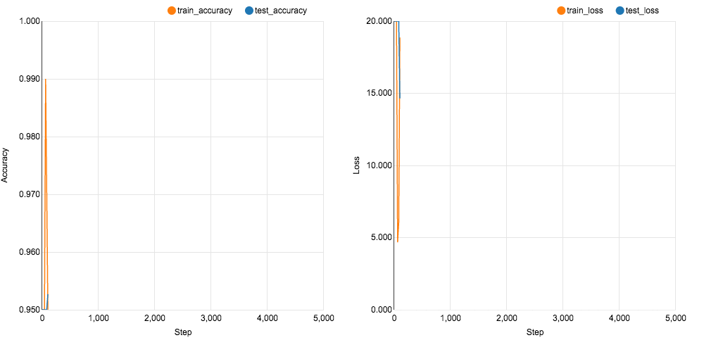

# A high level python interface to nvd3 for Juyopter and Zeppelin notebooks

## Usage


### Installation

	Install with `pip install .` and then load sample notebook


### Notebook

Load NVD3

```python
from nvd3_stat import Nvd3

nv = Nvd3()
nv.reloadNVD3(nvd3version="1.8.5", d3version="3.5.17")
```

#### Plot a line chart

```python
import pandas as pd

x = np.linspace(0, 4*np.pi, 100)

l_df = pd.DataFrame({"X":x,
                     "Sin":np.sin(x), 
                     "Cos":np.cos(x), 
                     "ArcTan":np.arctan(x-2*np.pi)/3})


lc = nv.lineChart()

config={"height":500, "width": 1024, "color":nv.c20b()[10:13], 
        "yAxis":{"axisLabel":"f(x)", "tickFormat":",.2f"}, 
        "xAxis":{"axisLabel":"x",    "tickFormat":",.2f"},
        "focusEnable": False, "duration":0}
        
lineAttributes={"area":[True, False, True], "fillOpacity":[0.2, 0, 0.2], "style":["dashed", "dotted", None]}

lc.plot(l_df[:70], "X", ["Sin", "Cos", "ArcTan"], lineAttributes, config)

```


Append data to the chart:
```
import time

for i in range(71,100):
    time.sleep(0.05)
    lc.append(l_df[i:i+1])
```

#### More demos

Sample Notebook:

[NVD3 Demo](notebooks/NVD3%20Demo.ipynb.ipynb)


#### Observer Tensorflow learning

Sample Notebook:

[TensorFlow with nvd3-stat](notebooks/TensorFlow%20with%20nvd3-stat.ipynb)

Visualisation part:


